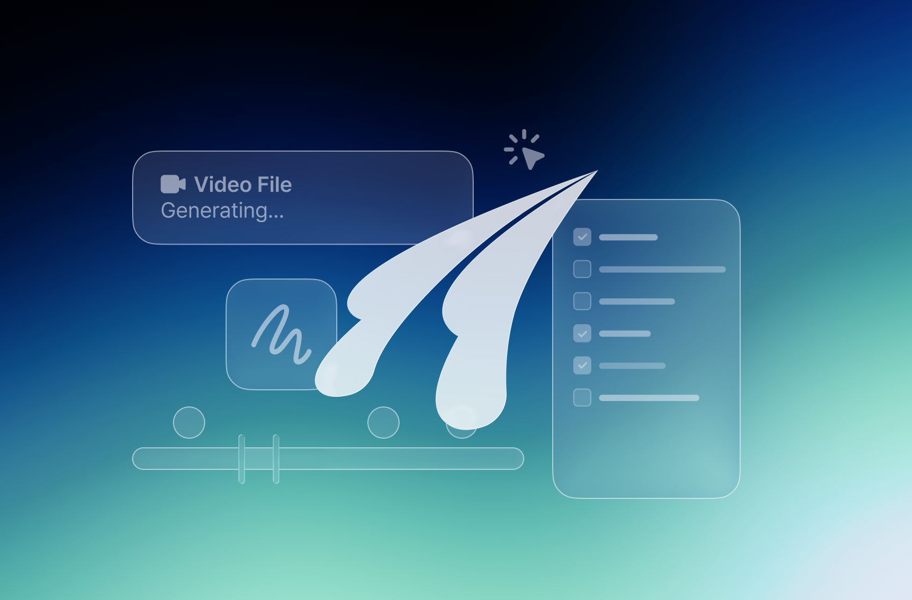

  <picture>
    <source media="(prefers-color-scheme: dark)" srcset="assets/logo-on-dark.svg">
    <source media="(prefers-color-scheme: light)" srcset="assets/logo-on-light.svg">
    
  </picture>

  <strong>기획부터 AI 영상·이미지 생성, 편집과 협업까지 
  상상을 함께 완성하는 하나의 창작 공간.</strong>

  <a href="https://github.com/ElbaCorp/youvico-desktop-release/releases/latest"><strong>최신 버전 다운로드 ↗</strong></a>
  &nbsp; · &nbsp;
  <a href="https://app.youvico.com">웹에서 시작하기</a>

Windows · macOS · Linux

  

## 기획부터 AI 생성, 편집과 협업까지

<table>
  <tr>
    <td width="50%" valign="top">
      
      <h3>상상을 AI 영상과 이미지로</h3>
      
상상하던 아이디어를 AI로 만들어보세요. 프로젝트 안에서 영상과 이미지를 생성하고 팀과 함께 발전시키세요.

    </td>
    <td width="50%" valign="top">
      
      <h3>생성에서 편집까지 이어서</h3>
      
생성한 영상과 업로드한 소스를 편집하고, 자막을 더해 원하는 결과물로 완성하세요.

    </td>
  </tr>
  <tr>
    <td width="50%" valign="top">
      
      <h3>다양한 콘텐츠를 한곳에서</h3>
      
영상, 오디오, 이미지, PDF와 문서를 열어보고 파일에 대한 피드백을 함께 확인하세요.

    </td>
    <td width="50%" valign="top">
      
      <h3>수정할 지점을 정확하게</h3>
      
영상의 특정 시점이나 구간에 댓글을 남기고, 펜·도형·텍스트로 화면에 직접 표시하세요.

    </td>
  </tr>
  <tr>
    <td width="50%" valign="top">
      
      <h3>파일과 팀의 대화를 함께</h3>
      
프로젝트별 파일과 폴더를 정리하고, 댓글·답글·멘션으로 필요한 팀원과 대화를 이어가세요.

    </td>
    <td width="50%" valign="top">
      
      <h3>3D 모델도 직접 살펴보기</h3>
      
3D 뷰어에서 모델을 회전하고 확대하며 여러 각도에서 확인하세요.

    </td>
  </tr>
</table>

## 최신 버전 다운로드

**[최신 릴리스 열기 →](https://github.com/ElbaCorp/youvico-desktop-release/releases/latest)**

릴리스 페이지의 **Assets**에서 내 컴퓨터에 맞는 설치 파일을 선택하세요. 최신 버전 번호와 변경 사항도 같은 페이지에서 확인할 수 있습니다.

| 내 컴퓨터 | 선택할 설치 파일 | 설치 방법 |
| --- | --- | --- |
| Windows · Intel / AMD 64비트 | 이름이 `win32-x64-Setup.exe`로 끝나는 파일 | 다운로드한 설치 파일을 실행하세요. |
| macOS · Apple Silicon (M 시리즈) | 이름이 `mac-Apple-Silicon-arm64.dmg`로 끝나는 파일 | DMG를 열고 YouViCo를 응용 프로그램 폴더로 옮기세요. |
| macOS · Intel | 이름이 `mac-Intel-x64.dmg`로 끝나는 파일 | DMG를 열고 YouViCo를 응용 프로그램 폴더로 옮기세요. |
| Linux · Debian / Ubuntu 계열 · x64 | `.deb` 파일 | 배포판의 패키지 설치 도구로 설치하세요. |
| Linux · Fedora / RHEL 계열 · x64 | `.rpm` 파일 | 배포판의 패키지 설치 도구로 설치하세요. |

Mac의 칩 종류는 Apple 메뉴 → **이 Mac에 관하여**에서 확인할 수 있습니다.

Assets에 파일이 여러 개 보여요

위 표의 설치 파일을 선택하면 됩니다. macOS용 `.zip`도 제공됩니다.

`RELEASES`와 `.nupkg`는 Windows 자동 업데이트용 파일입니다. GitHub가 표시하는 `Source code (zip)`과 `Source code (tar.gz)`는 앱 설치 파일이 아닙니다.

## 업데이트

**Windows와 macOS**에서는 앱이 새 버전을 확인합니다. 업데이트 안내에서 **다운로드**를 선택하고, 준비가 끝나면 작업을 저장한 뒤 **재시작하여 설치**를 눌러주세요. 앱 메뉴의 **업데이트 확인**으로 직접 확인할 수도 있습니다.

**Linux**에서는 [최신 릴리스](https://github.com/ElbaCorp/youvico-desktop-release/releases/latest)의 설치 파일로 업데이트하세요.

0.1.17 또는 0.1.18을 사용하고 있나요?

Windows와 macOS에서는 앱 메뉴의 **업데이트 확인**을 누른 뒤 **다운로드**를 선택하세요. 준비가 끝나면 작업을 저장하고 **재시작하여 설치**를 눌러 `0.1.20`으로 업데이트할 수 있습니다. 이후 버전도 앱에서 계속 업데이트할 수 있습니다.

앱 내 업데이트가 진행되지 않거나 더 오래된 버전을 사용하고 있다면 [최신 설치 파일](https://github.com/ElbaCorp/youvico-desktop-release/releases/latest)을 내려받아 직접 설치하세요.

---

이 저장소는 YouViCo Desktop의 공식 다운로드와 릴리스 안내를 제공합니다. 앱 이용에는 인터넷 연결이 필요합니다.

[웹에서 YouViCo 열기](https://app.youvico.com) · [전체 릴리스 보기](https://github.com/ElbaCorp/youvico-desktop-release/releases)
